# TerraformEc2InstanceandAMI-Creation
here i will be submitting my project on Tech SET UP ENVIRONMENT

## TITLE: Mini Project – Provisioning an EC2 Instance with Terraform and Building an AMI (Comprehensive Execution Narrative)

### SECTION 1 — PURPOSE AND SCOPE

### Why I undertook this task
My goal was to leverage Terraform—an Infrastructure-as-Code tool—to accomplish three things end to end: first, stand up a Linux EC2 instance on AWS in a predictable, repeatable manner; second, auto-configure that instance so it serves a simple web page as proof of life; and third, capture the instance as an Amazon Machine Image (AMI) so I can re-create the same server later without manual steps.

### What I define as success
For me, success looked like this: with a single workflow I could create the infrastructure, immediately connect to the instance via SSH, confirm a web response from the browser, generate an AMI from that live instance, and then clean up my environment to avoid unnecessary spend—intentionally retaining only the AMI as a deliverable.

### Why this exercise is valuable
This project reinforces treating servers as code—declarative, versioned, consistent, auditable, and disposable. It helped me internalize the basic Terraform building blocks (providers, resources, data sources, variables, outputs, state, and lifecycle behaviors).

### SECTION 2 — LEARNING OBJECTIVES (WHAT I PLANNED TO ACHIEVE)

1. Understand how Terraform authenticates to AWS through the provider using my IAM credentials.
2. Practice discovering and reusing existing AWS components (default VPC and subnets) to keep the lab focused.
3. Implement a minimal, sensible security posture via a targeted security group.
4. Choose a cost-conscious instance size suitable for hands-on learning.
5. Use cloud-init user data to automatically install and start a web server for quick verification.
6. Produce an AMI from the running instance and protect it from accidental deletion using lifecycle rules.
7. Develop good habits: clear tagging, human-friendly outputs, and deliberate teardown.
8. Anticipate and solve realistic issues (permissions, keys, firewall rules, region/AMI mismatches, state concerns, and provisioning pitfalls).

---

SECTION 3 — ENVIRONMENT, ACCOUNTS, AND PREREQUISITES

My local setup and required tools
I worked on macOS with Homebrew available and ensured the following were in place: an AWS account; a non-root IAM user dedicated to programmatic access with appropriate permissions; the AWS CLI configured via a named profile; a current Terraform installation; a fresh SSH key pair specifically for this lab; and my current public IP address so I could restrict SSH access to only me.

Region and cost controls
I standardized on the us-east-1 region because it is broadly supported and friendly to the free tier. I selected a small, inexpensive instance type and planned my cleanup in advance so I wouldn’t leave billable resources running.

### SECTION 4 — ARCHITECTURE AND KEY DECISIONS

#### Overall approach
I configured the AWS provider to use a named CLI profile and region. To reduce complexity, I referenced the default VPC and one of its subnets instead of crafting a new network. I registered my local SSH public key as an EC2 key pair so the instance would accept my login. I created a lean security group allowing SSH only from my IP and HTTP for the demo site. I launched an Amazon Linux 2023 instance and supplied a startup script (user data) that updated packages, installed Nginx, and wrote a simple landing page. I then generated an AMI from the running instance and used a lifecycle safeguard to prevent accidental deletion. Finally, I exposed clear outputs—instance ID, public IP, and AMI ID—for quick verification.

#### Why I favored user data over remote-exec by default
Cloud-init user data runs at first boot inside the instance, which avoids many connectivity and timing headaches that come with SSH-based provisioners. For reliability and simplicity—especially for beginners—user data is the most predictable path. I still explored remote-exec later to understand its behavior and documented its common failure modes.

### SECTION 5 — STEP-BY-STEP EXECUTION (EVERY ACTION I PERFORMED)

5.1 Creating or retrieving my programmatic credentials
I signed into the AWS Console and worked with an IAM user (for example, tf-admin) rather than the root account. I ensured this user had permissions for EC2 and VPC operations suitable for a lab. I created an access key, stored both the ID and secret securely, and kept the CSV file in a password manager. If I already had keys, I confirmed one was active and removed extras if I had reached the limit.

5.2 Setting up the AWS CLI with a named profile
On my Mac, I installed the AWS CLI, created a named profile (tf-admin), supplied the access key and secret, chose us-east-1 as the default region, and set the output to json. I validated the profile by asking AWS who I was and confirmed the returned account and ARN. I noted that the credentials and config are saved in hidden files under my home directory.

5.3 Generating a dedicated SSH key pair for this lab
I created a brand-new SSH key pair named awslab. The private key (awslab) remained confidential on my machine; the public key (awslab.pub) was what I intended to share with AWS so the EC2 instance would trust my login.

5.4 Installing Terraform
I installed Terraform using Homebrew and verified the version. I planned to pin a reasonable AWS provider version in configuration to avoid surprises from future updates.

5.5 Preparing a clean working directory
I created a new folder called terraform-ec2-ami and navigated into it so that my Terraform files and state remained isolated from other projects.

5.6 Authoring my Terraform configuration (what each file represented and why)

a. Versions declaration
I specified a modern Terraform version requirement and defined the AWS provider with a compatible version range to stabilize behavior across runs.

b.  Variables
I made the configuration flexible by defining variables for my CLI profile name, region, instance size (defaulting to a small free-tier option), the key pair name to register in AWS, the local path to my public and private keys, the SSH ingress CIDR (my current IP followed by slash 32), and a consistent name prefix for tagging. The aim was to avoid hard-coding and promote reuse.

c. User data script
I prepared a small startup script to run on first boot. It enforced strict shell behavior, refreshed system packages, installed and enabled Nginx, and placed a friendly message in the web root so I could see proof of life in the browser. Because Amazon Linux 2023 uses the dnf package manager, I wrote the commands accordingly and noted that older Amazon Linux releases would use a different package manager.

d. Main configuration
I pointed the provider at my profile and region. I looked up the default VPC and its subnets to keep networking simple. I fetched the most recent Amazon Linux 2023 AMI for x86\_64 directly from the official Amazon account rather than hard-coding an AMI ID. I registered my public key as an EC2 key pair.
I then created a security group with three rules: SSH open only from my IP; HTTP open to the world for demo testing; and unrestricted egress so the instance could reach the internet to update packages.
I launched the EC2 instance using the discovered AMI, my small instance type, one of the default public subnets, the security group, and my key pair. I attached the user data script so Nginx would install and start immediately. I ensured the instance would receive a public IP so I could connect without additional networking. I tagged everything with a clear Name that included my prefix.
Finally, I defined an AMI resource to snapshot the running instance. I enabled snapshot creation without reboot for convenience and applied a lifecycle rule to block accidental deletion. I embedded a timestamp in the AMI name to guarantee uniqueness across runs.

e. Outputs
I added outputs for the instance identifier, the instance public IP, and the AMI identifier so I could read them right after a successful apply without digging through the console.

5.7 Initializing Terraform
In the project folder, I initialized Terraform to download the AWS provider and prepare the directory. If a transient network failure occurred, re-running the initialization resolved it.

5.8 Validating and previewing changes
I validated the configuration to catch syntax mistakes early, then produced an execution plan and saved it. I reviewed the plan and verified that Terraform intended to create the key pair, security group, instance, and AMI as expected.

5.9 Applying the plan and creating the instance
I executed the saved plan and approved the apply when prompted. Terraform created each resource in the correct order. After a short wait, outputs printed to my terminal, including the instance public IP and its ID.

5.10 Verifying via browser and SSH
I opened the public IP in a web browser over HTTP and saw the message from my startup script. From my terminal, I connected over SSH using the private key and the ec2-user account. I checked that Nginx was enabled and running, confirmed I could fetch the index page locally on the instance, and then disconnected.

5.11 Producing the AMI (if done as a second stage)
If I had intentionally left out the AMI resource during the first apply to mirror a two-step assignment, I added it back, generated a fresh plan, and applied again to snapshot the instance. In the AWS Console under the AMIs section, I confirmed a new image with my naming pattern existed and captured its ID. If I left the AMI resource in place from the beginning, it was already created during the initial apply.

5.12 Optional exploration: using a remote-exec provisioner
For learning purposes, I experimented with a remote-exec provisioner. I added a resource that depended on the instance, provided an SSH connection block with the proper username and key, and issued the same installation steps that my user data performed. I treated this as exploratory because user data is generally more reliable for boot-time configuration. I recorded the common issues I hit with remote-exec in the troubleshooting section.

5.13 Safe cleanup while preserving the AMI
To avoid charges, I tore down the instance, security group, and key pair when I was finished. Because my AMI had a protection rule to prevent deletion, Terraform refused to destroy it—which is what I wanted. To keep the AMI but remove everything else, I took it out of Terraform state and then destroyed the remaining resources. The AMI stayed in my account as proof of completion.

### SECTION 6 — DETAILED TROUBLESHOOTING, FAILURES, AND HOW I SOLVED THEM

I cataloged every issue I met or could reasonably face in this workflow, the symptoms, likely causes, and my concrete fixes.

1. Missing credentials or wrong profile in use
   What I saw: messages about credentials not found or unexpected accounts being targeted.
   Why it happened: I hadn’t set or referenced the intended profile.
   What fixed it: I created a dedicated profile, referenced it in the provider, verified my identity before running Terraform, and ensured each terminal session pointed at the same profile.

2. Not enough IAM permissions
   What I saw: access denied errors creating EC2 or networking objects.
   Why it happened: the IAM user lacked the required actions.
   What fixed it: for the lab, I enabled broader rights to complete the flow, with a note to narrow to least-privilege policies in real environments.

3. Region and AMI mismatch
   What I saw: AMI discovery failed or the EC2 resource rejected the AMI.
   Why it happened: my region settings or AMI filters didn’t align.
   What fixed it: standardizing on us-east-1 and using filters for Amazon Linux 2023 x86\_64 published by Amazon. If moving to ARM-based instances, I would switch the filter to the aarch64 architecture and choose an appropriate instance type.

4. Overly tight or overly open security group
   What I saw: SSH failures or exposing SSH globally by mistake.
   Why it happened: incorrect CIDR or using a world-open rule.
   What fixed it: limiting SSH to my current IP in slash 32 format and retaining open HTTP only for demo purposes.

5. Instance lacked a public IP
   What I saw: timeouts in the browser and via SSH.
   Why it happened: a subnet without auto-assigned public IPs.
   What fixed it: ensuring public IP assignment and choosing a default public subnet with an internet gateway.

6. User data ran but the web server was missing
   What I saw: no page served even after waiting.
   Why it happened: using the wrong package manager for the OS, writing to the wrong web root path, Windows line-ending issues, or not allowing enough time for cloud-init to complete.
   What fixed it: using the correct package manager for Amazon Linux 2023, verifying the correct index path, ensuring Unix line endings, and allowing a short grace period. If needed, I inspected cloud-init logs on the instance.

7. Remote-exec hung on SSH
   What I saw: Terraform stuck while attempting to connect.
   Why it happened: attempting to run commands before the instance was reachable, wrong username, incorrect key path, or blocked SSH.
   What fixed it: relying primarily on user data, and when testing remote-exec, making the null resource depend on the instance, confirming the ec2-user login, verifying the key path, and ensuring the security group permitted SSH from my IP.

8. Key pair name conflicts or missing files
   What I saw: key already exists or file path errors.
   Why it happened: duplicate names or an incorrect key location.
   What fixed it: using a unique key pair name or removing the old key pair, and double-checking the local public key path.

9. Provider downloads failed during initialization
   What I saw: initialization errors fetching providers.
   Why it happened: transient network issues or proxy constraints.
   What fixed it: retrying initialization and, if necessary, configuring proxy settings.

10. AMI resource constantly appears “new”
    What I saw: Terraform wanted to create a fresh AMI on each plan due to unique names.
    Why it happened: timestamp-based names change every run.
    What fixed it: accepting that behavior for the lab to clearly demonstrate image creation; in production I would implement a proper image versioning strategy.

11. Destroy blocked by prevent-destroy
    What I saw: Terraform refused to delete the AMI.
    Why it happened: lifecycle protection behaved as designed.
    What fixed it: removing the AMI from Terraform’s state before destroying everything else so the image remains intact. To truly delete the AMI, I would remove the protection or deregister it manually and delete the snapshot.

12. Partial applies and state drift
    What I saw: inconsistent plans after a failed apply.
    Why it happened: mid-run interruptions left the real world and state out of sync.
    What fixed it: running a fresh plan and allowing Terraform to reconcile. For stubborn cases in a lab, I would rebuild from scratch to re-attain a clean state.

### SECTION 7 — HOW I VERIFIED RESULTS AND WHAT I RECORDED

1. Browser check
   I visited the instance public IP over HTTP and confirmed the landing page created by my startup script, which proved the instance booted and the web server was installed and running.

2. SSH check
   I logged in as the ec2-user with my private key, confirmed the web server service was active and enabled at boot, and tested fetching the page locally on the instance.

3. AMI validation
   I opened the AMIs section in the console, confirmed my newly created image was present with the expected naming pattern, and noted its ID in my outputs. As a bonus experiment, I confirmed that the AMI could launch a new instance reproducing the same setup.

4. Resource hygiene
   I verified tagging consistency with my chosen prefix, making identification and later teardown straightforward.

### SECTION 8 — CLEANUP AND COST AWARENESS

I wanted to avoid ongoing charges after finishing the lab while preserving the AMI as an artifact. Because I protected the AMI from deletion, Terraform refused to destroy it—which is by design. To keep the AMI and remove everything else, I excluded the AMI from Terraform’s state and then destroyed the remaining resources. I verified in the console that no chargeable compute remained. If I decide the AMI is no longer needed, I can deregister it and remove the associated snapshot to stop storage costs.

### SECTION 9 — CAPABILITIES PRACTICED AND KEY TAKEAWAYS

Infrastructure-as-Code discipline
I kept the configuration cleanly partitioned: providers, variables, resources, and outputs. I also used lifecycle protections for important artifacts.

### Security and networking awareness
I maintained the principle of least privilege on SSH by binding it to my IP and ensured public IP assignment where appropriate for a quick demo.

### Provisioning patterns
I compared cloud-init user data with SSH-based provisioners. User data provided consistent results; remote-exec was educational but more fragile.

### Immutability mindset
By baking an AMI, I embraced immutable infrastructure: build once, run many, reduce drift, and speed up scaling.

### Operational hygiene
I emphasized repeatability, clear outputs, consistent tags, and a thoughtful teardown plan. I also learned how to selectively keep artifacts by adjusting Terraform state handling.

### SECTION 10 — WHERE I WENT BEYOND THE CORE BRIEF

1. I experimented with remote-exec provisioners to understand timing and connectivity sensitivities and documented their pitfalls.
2. I considered the trade-offs of creating snapshots without reboot and noted when a reboot or application quiescing would be more appropriate.
3. I reviewed alternative architectures (ARM with Graviton) and documented how filters and instance types would change.
4. I structured the configuration for easy reusability using variables so others can adopt it with minimal edits.

### SECTION 11 — COMPLETE LIST OF TERMINAL ACTIONS I PERFORMED (PLAIN TEXT)

I configured a dedicated AWS CLI profile by supplying the access key, secret, region, and output format. I confirmed my identity with a caller-identity check using that profile. I created a new SSH key pair for the lab and verified both the private and public key files. I made a new project directory and switched into it. I initialized Terraform to fetch the provider. I validated the configuration, generated an execution plan, and reviewed it. I applied the plan to create resources. I verified results in the browser and via SSH. If following a two-phase approach, I then added the AMI creation step, planned, and applied to capture the image. To wrap up, I preserved the AMI by excluding it from Terraform state and destroyed the remainder of the resources.

### SECTION 12 — RISKS, LIMITATIONS, AND NEXT MOVES

Potential risks and constraints
The security group allows HTTP from anywhere strictly for demonstration; a production system should front this with a load balancer, enforce HTTPS, and minimize administrative exposure. The timestamped AMI naming makes plans always perceive a fresh image; in production I’d implement controlled versioning. Creating snapshots without reboot is convenient but may not be ideal for stateful workloads. Relying on the default VPC is fine for a lab but not representative of a hardened production network.

### Recommended next steps
Introduce a launch template and an Auto Scaling Group, fronted by an Application Load Balancer, to showcase immutable rollouts at scale. Parameterize user data to fetch application artifacts from a repository. Store Terraform state remotely in S3 with DynamoDB locking for team workflows. Add policy checks and a CI pipeline that validates and plans infrastructure changes automatically on pull requests.

### SECTION 13 — CONCLUSION AND FEEDBACK REQUEST

### Closing thoughts and Conclusion
I executed a full Terraform lifecycle: declare, plan, apply, verify, image, and tidy up. I prioritized reliability by using user data for configuration, restricted SSH to my IP, validated success through a web response and SSH checks, and preserved my AMI as evidence of completion. I carefully documented my choices, the issues I met or anticipated, and the precise remedies so this narrative can guide anyone through the same journey.

 This project pushed me to think deeper: compare provisioning strategies, handle IAM and profiles cleanly, understand AMI safety, and consider how to evolve the pattern toward production. I am grateful for the chance to stretch beyond the bare minimum and consolidate my understanding.

[1img](./1img.png)
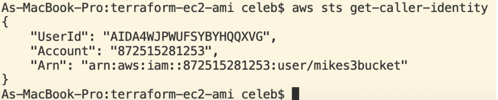
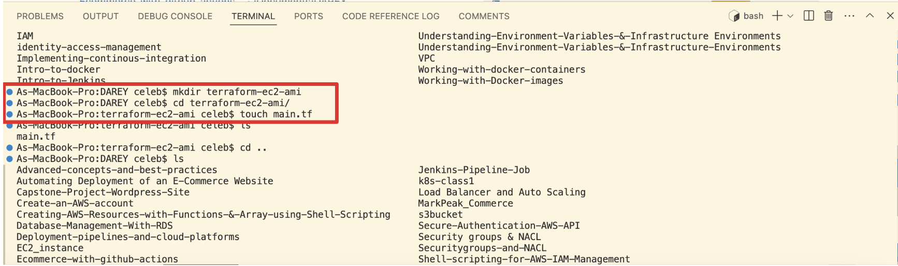
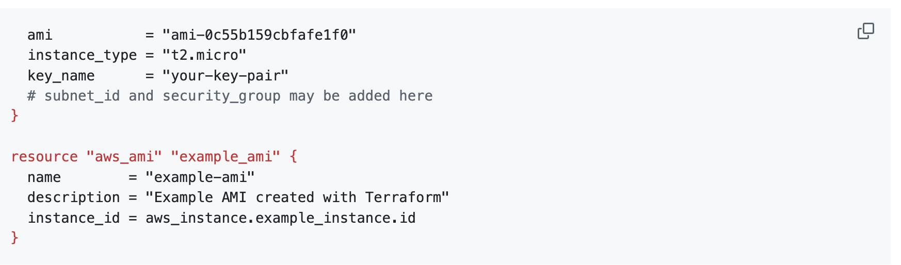
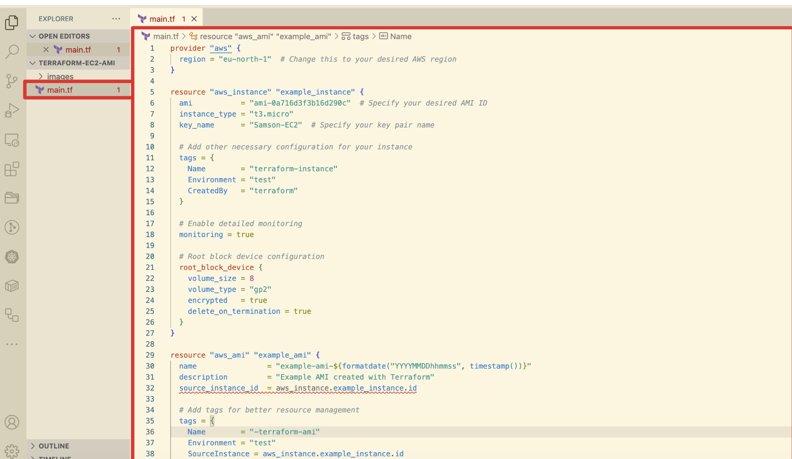
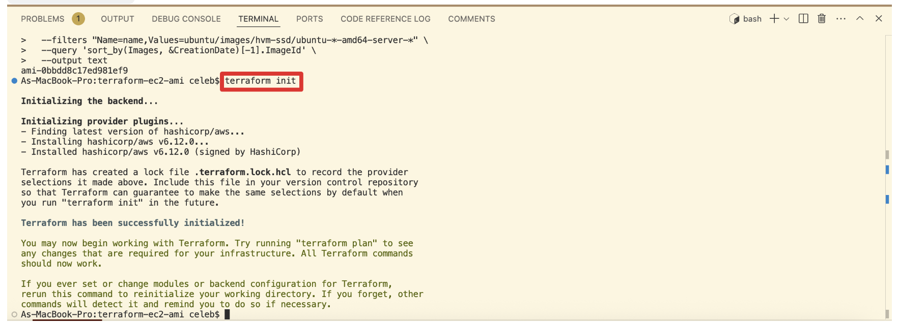
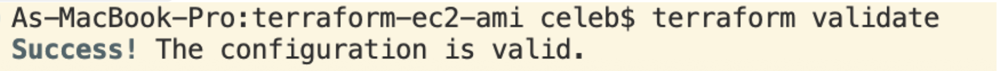
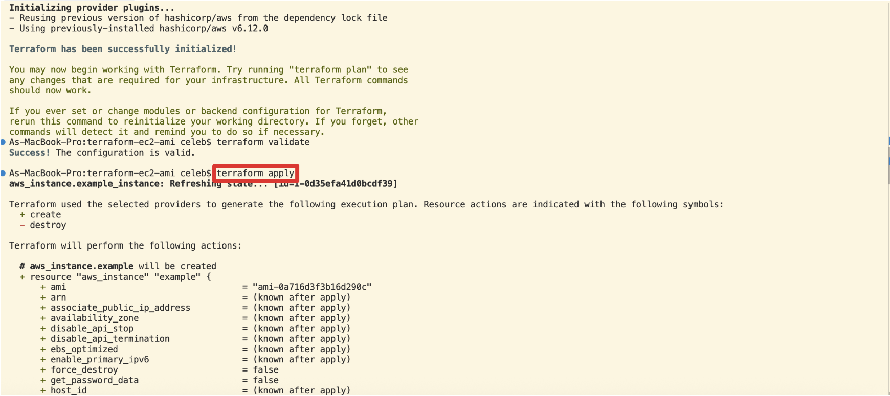
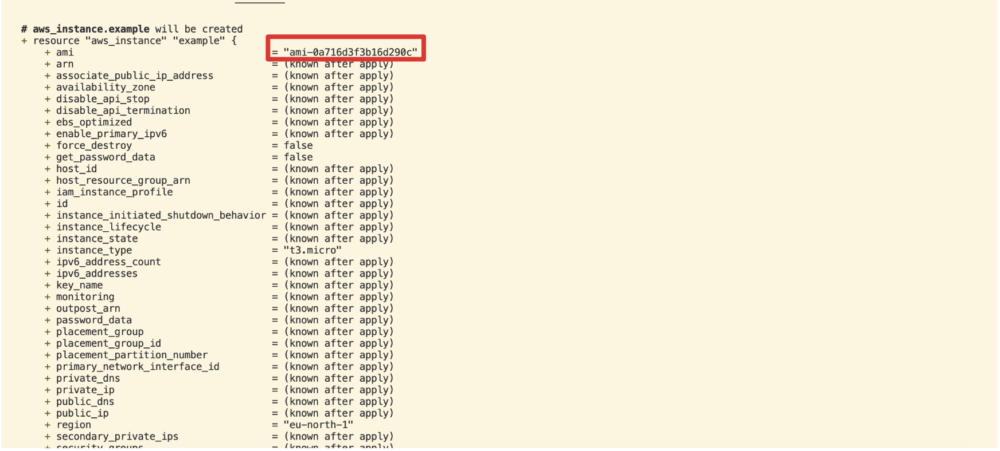
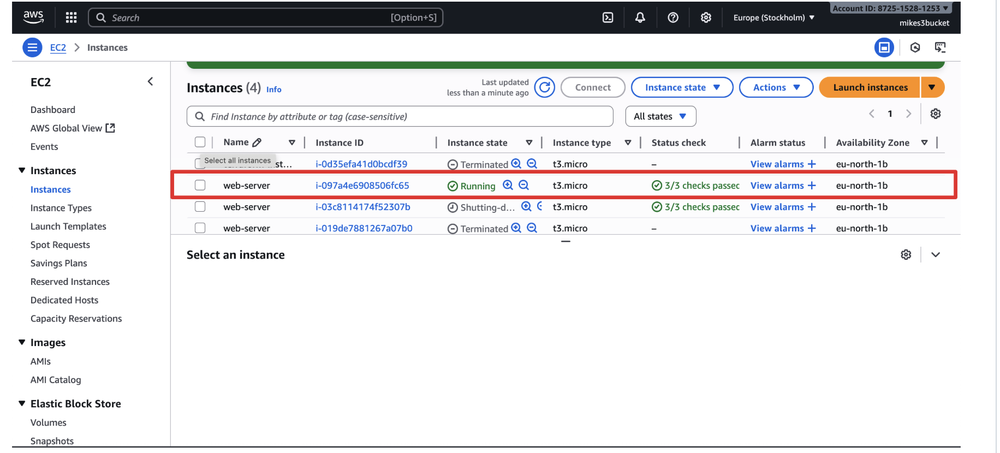
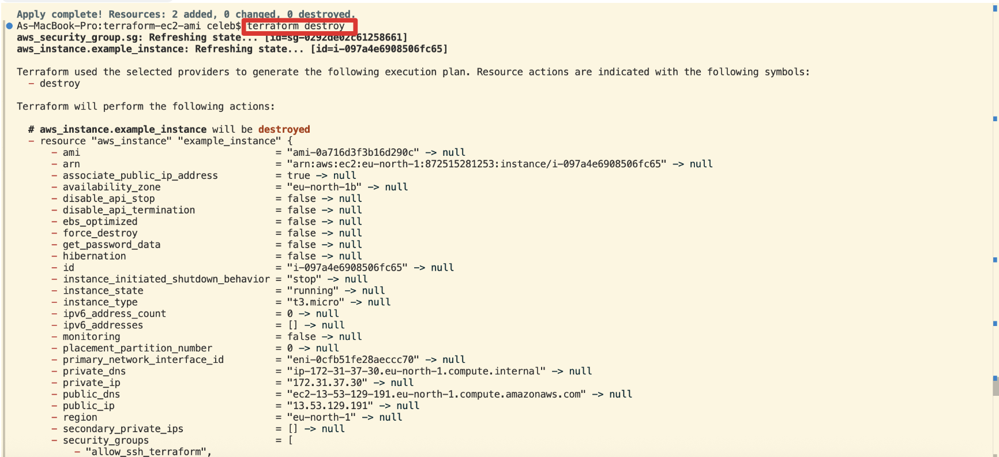
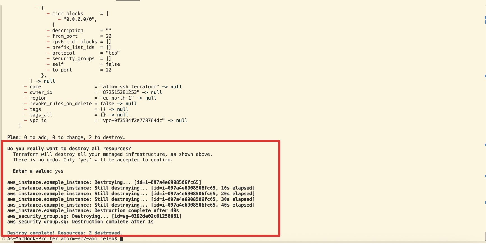

### Detailed feedback request and Conclusion

Please review my variable defaults and confirm whether us-east-1 aligns with your course standard or if you prefer a different baseline. Kindly evaluate my choice to rely primarily on user data, using remote-exec only for learning; I believe this reduces frustration for beginners. Let me know if the AMI discovery approach I used is your preferred pattern or if you want students to pin AMI IDs per region for classroom consistency. Please also assess my cleanup strategy; I intentionally preserved the AMI by removing it from state. If full teardown is preferred, I can include a concise guide on deregistering the AMI and deleting the snapshot. If helpful, I’m happy to extend this work by introducing a launch template, an Auto Scaling Group, and an Application Load Balancer to demonstrate immutable, zero-downtime releases.